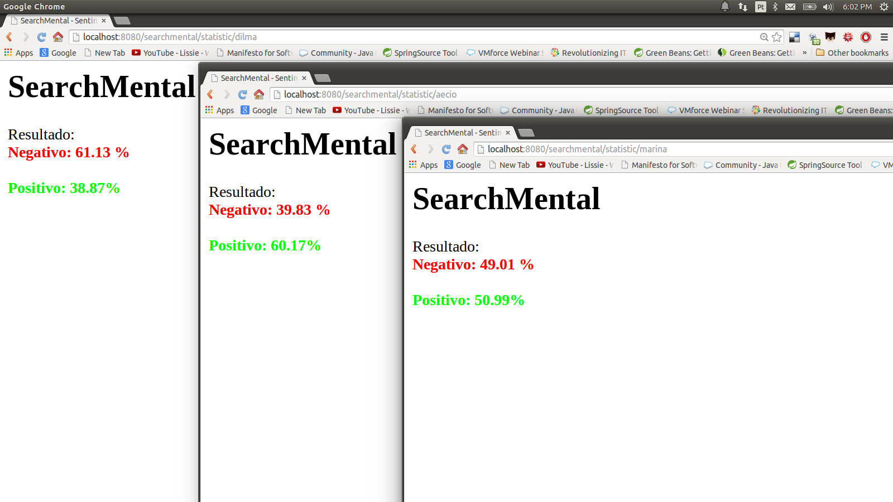

# SearchMental - WebApp de Análise de Sentimentos

O SearchMental é uma Webapp para análise de sentimentos que análise textos de diversas fontes (Hoje só o twitter).

A aplicação é escrita em Java e roda em web containers como o Tomcat.  

